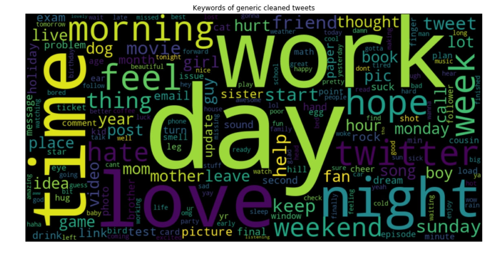
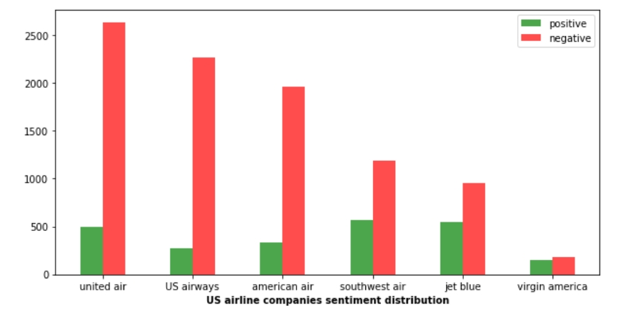

# US airline sentiment analysis

> [Here is the link directly to Kaggle](https://www.kaggle.com/crowdflower/twitter-airline-sentiment)

In a whole, this is a NLP project to analyze public sentiment towards US airlines in 2015 using tweets, meanwhile give some insights and recommendation to airlines.

The datasets used in my project cannot upload due to size limit, they include:

* US_airline_tweets.csv - a list of tweets regarding several US airlines, a little modified from Kaggle

* generic_tweets.txt - tweets that have had their sentiments already analyzed and recorded as binary values 0 for negative and 4 for positive

## Table of contents

* Objective
  - Parse and clean data using nltk
  - Create visualizations to present insights
  - Build Logistic Regression on generic tweets to do sentiment classification
  - Tried the model above on US airline dataset and see the result
  - Build multi-class LR on negative reasons in US airline dataset to predict

* Good points
  - Use of the most common word frequency as features
  - NLP tools
  - LR and multi-class LR
  
* Future work
  - Use POS to interpret tweets and count POS frequency as features
  - Tune hyperparameters in LR
  - Try other algorithms

